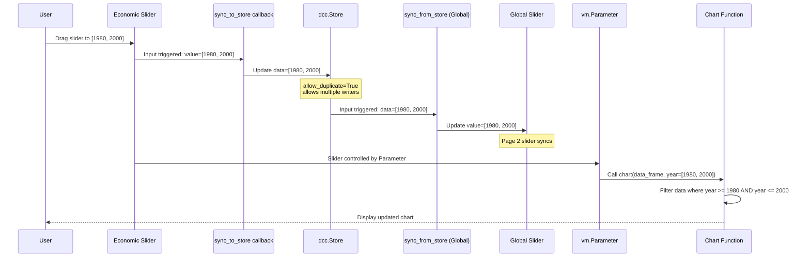
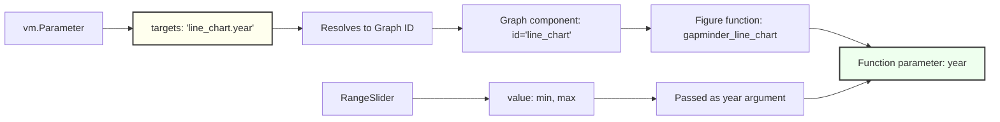
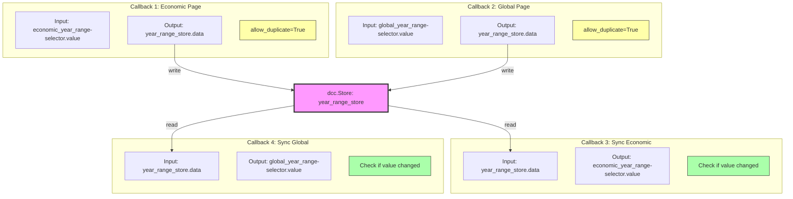

# Vizro Cross-Page Filter Architecture

This document explains the architecture and control flow of the cross-page filtering implementation using Vizro, Dash callbacks, and `dcc.Store`.

## Overview

This example demonstrates how to create synchronized filters across multiple pages in a Vizro dashboard. When a user changes the year range filter on one page, the same filter is automatically applied to all charts on other pages.

## Architecture Components

### 1. Data Management
- **`data_manager`**: Vizro's data manager handles lazy loading and caching of datasets
- **`load_gapminder_data()`**: Function registered with data_manager for loading the gapminder dataset

### 2. Parameter Controls
- **`vm.Parameter`**: Vizro component that passes slider values to chart function arguments
- **`vm.RangeSlider`**: The UI selector that users interact with

### 3. State Synchronization
- **`dcc.Store`**: Dash component for storing shared state across pages
- **Custom Callbacks**: Bidirectional sync between sliders and the store

### 4. Chart Functions
- **`@capture("graph")`**: Decorator that enables custom charts to work with Vizro
- **`year` parameter**: Receives filter values from `vm.Parameter`

## Control Flow Diagram

```mermaid
graph TB
    subgraph "Page 1: Economic Trends"
        Slider1[RangeSlider<br/>ID: economic_year_range-selector]
        Param1[vm.Parameter<br/>ID: economic_year_range<br/>Target: line_chart.year]
        Chart1[gapminder_line_chart<br/>year parameter]
    end

    subgraph "Page 2: Global Analysis"
        Slider2[RangeSlider<br/>ID: global_year_range-selector]
        Param2[vm.Parameter<br/>ID: global_year_range<br/>Target: scatter_chart.year, bar_chart.year]
        Chart2[gapminder_scatter_chart<br/>year parameter]
        Chart3[gapminder_bar_chart<br/>year parameter]
    end

    subgraph "Shared State"
        Store[dcc.Store<br/>ID: year_range_store<br/>Storage: session]
    end

    subgraph "Synchronization Callbacks"
        CB1[sync_to_store<br/>Economic → Store]
        CB2[sync_from_store<br/>Store → Economic]
        CB3[sync_to_store<br/>Global → Store]
        CB4[sync_from_store<br/>Store → Global]
    end

    User([User Interaction])

    %% User interaction flow
    User -->|Drags slider| Slider1
    User -->|Drags slider| Slider2

    %% Page 1 Flow
    Slider1 -->|value changed| CB1
    CB1 -->|update| Store
    Store -->|data changed| CB2
    CB2 -->|sync value| Slider1
    Param1 -->|year=[min, max]| Chart1
    Slider1 -.->|controlled by| Param1

    %% Page 2 Flow
    Slider2 -->|value changed| CB3
    CB3 -->|update| Store
    Store -->|data changed| CB4
    CB4 -->|sync value| Slider2
    Param2 -->|year=[min, max]| Chart2
    Param2 -->|year=[min, max]| Chart3
    Slider2 -.->|controlled by| Param2

    %% Cross-page sync
    Store -.->|triggers| CB4
    Store -.->|triggers| CB2

    style Store fill:#f9f,stroke:#333,stroke-width:4px
    style CB1 fill:#bbf,stroke:#333,stroke-width:2px
    style CB2 fill:#bbf,stroke:#333,stroke-width:2px
    style CB3 fill:#bbf,stroke:#333,stroke-width:2px
    style CB4 fill:#bbf,stroke:#333,stroke-width:2px
```

## Detailed Control Flow

### Step 1: User Interaction on Page 1



### Step 2: Parameter Target Resolution



## Key Implementation Details

### 1. Component ID Structure

Each component has a unique ID that follows this pattern:

```python
# Slider ID format
f"{prefix}year_range-selector"  # e.g., "economic_year_range-selector"

# Parameter ID format
f"{prefix}year_range"  # e.g., "economic_year_range"

# Target format (links Parameter to Chart)
f"{component_id}.year"  # e.g., "line_chart.year"
```

### 2. Parameter Target Mechanism

The `vm.Parameter` uses the `targets` attribute to specify which chart function arguments to control:

```python
year_range_parameter = vm.Parameter(
    id="economic_year_range",
    targets=["line_chart.year"],  # Controls the 'year' arg of 'line_chart'
    selector=vm.RangeSlider(...)
)
```

When the slider changes:
1. `vm.Parameter` receives the new value from the slider
2. It passes this value to the chart function's `year` argument
3. The chart function re-executes with the new `year` value
4. Vizro updates the display

### 3. Cross-Page Synchronization Pattern



**Why `allow_duplicate=True`?**
- Both Economic and Global pages have callbacks that write to the same `year_range_store.data`
- Dash normally prevents duplicate outputs to avoid conflicts
- `allow_duplicate=True` explicitly allows multiple callbacks to update the same output
- Each callback only fires when its specific input changes

### 4. Data Flow in Chart Functions

```python
@capture("graph")
def gapminder_line_chart(data_frame: pd.DataFrame, year=None):
    # Step 1: Receive filtered year range from Parameter
    if year is not None:
        min_year, max_year = year  # e.g., [1980, 2000]

        # Step 2: Filter the dataframe
        data_frame = data_frame[
            (data_frame["year"] >= min_year) &
            (data_frame["year"] <= max_year)
        ]

    # Step 3: Apply additional filtering
    df_filtered = data_frame[data_frame["country"].isin(countries)]

    # Step 4: Create and return the chart
    return px.line(df_filtered, x="year", y="gdpPercap", ...)
```

## File Structure

```
vizro-filter/
├── vizro_cross_filter_across_pages.py  # Main dashboard implementation
├── requirements.txt                     # Dependencies
└── README.md                           # This documentation
```

## How to Run

1. Install dependencies:
```bash
pip install -r requirements.txt
```

2. Run the dashboard:
```bash
python vizro_cross_filter_across_pages.py
```

3. Open browser to: `http://127.0.0.1:8050`

## Key Concepts Explained

### vm.Parameter vs vm.Filter

| Feature | vm.Parameter | vm.Filter |
|---------|-------------|-----------|
| Purpose | Pass values to function arguments | Filter DataFrame rows |
| Target | Function parameter (e.g., `year`) | DataFrame column (e.g., `df["year"]`) |
| Usage | Custom logic in function | Automatic DataFrame filtering |
| Flexibility | Full control in function | Limited to filtering |

### Why This Architecture?

1. **Separate Parameters per Page**: Each page has its own Parameter to avoid target validation errors (scatter_chart doesn't exist on Economic page)

2. **dcc.Store for Sync**: Acts as a shared state repository that both pages can read from and write to

3. **Bidirectional Callbacks**:
   - `sync_to_store`: Updates store when slider changes
   - `sync_from_store`: Updates slider when store changes from another page

4. **Infinite Loop Prevention**: Check if value changed before updating to avoid circular callback chains

## Educational Notes

This implementation demonstrates:

- **Vizro Best Practices**: Using `data_manager` for data loading and `@capture("graph")` for custom charts
- **Dash State Management**: Using `dcc.Store` for cross-component state sharing
- **Callback Patterns**: Implementing bidirectional sync with duplicate output handling
- **Type Hints**: Clear function signatures showing expected parameter types
- **Educational Comments**: Code includes explanations about specific Vizro logic

## Troubleshooting

### Common Issues

1. **Duplicate Output Error**:
   - Solution: Add `allow_duplicate=True` to Output in callbacks writing to the store

2. **Target Not Found Error**:
   - Solution: Ensure target component IDs exist on the page where the Parameter is defined

3. **Infinite Callback Loop**:
   - Solution: Check if value changed before updating in `sync_from_store` callback

4. **Year Parameter Not Working**:
   - Solution: Ensure chart functions accept `year=None` parameter and use it for filtering
